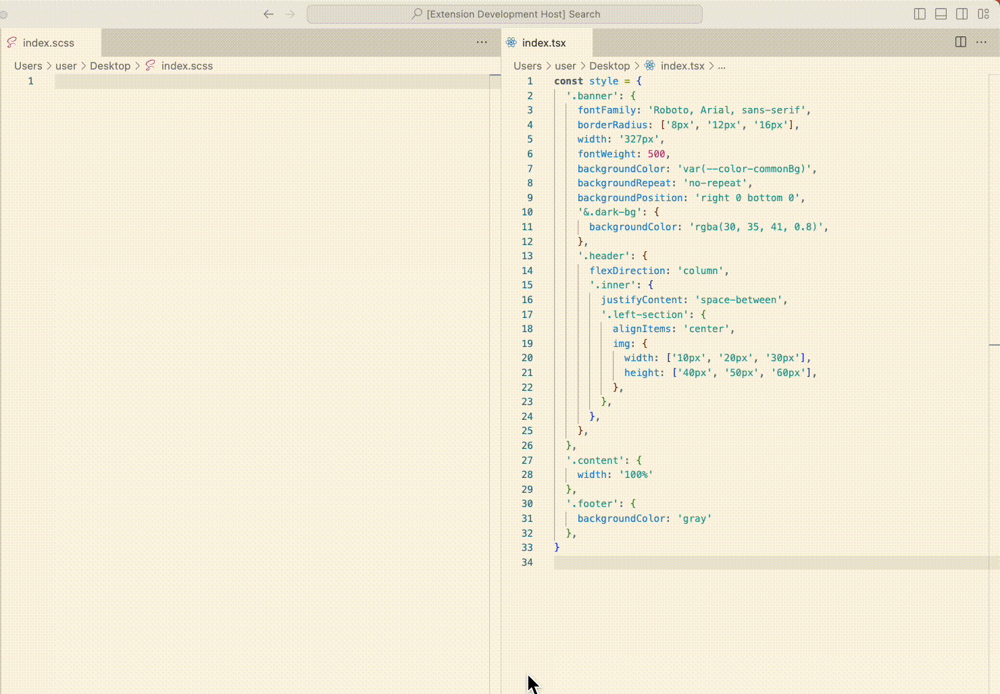

# CSS in JS converter

This is a converter that can convert between CSS-in-JS code and SCSS code!

## Features

All you have to do is:

Select a style object or some css code, press **cmd + p**, type in **convert**, hit enter and check the result :)

**Enjoy!**
